# Traffic Analysis Report — Fake Software Download Site

**Analyst:** SOC Analyst (Student Project)  
**Category:** Network Forensics & Malware Traffic Analysis  
**Tools Used:** Zeek, Wireshark, CyberChef, VirusTotal, ELK Stack  
*This analysis is based solely on network evidence; no endpoint forensics were available to confirm payload execution or persistence mechanisms.*

---

## Executive Summary

This report investigates malicious network activity originating from a fake software download website.  
Captured traffic revealed PowerShell payloads, command-and-control (C2) communications over HTTP, and data exfiltration (~10 MB) to an external IP.  
Artifacts confirm staged payload delivery and exfiltration via encoded HTTP sessions.

---

## Table of Contents

1. [Key Artifacts & IOCs](#key-artifacts--iocs)  
2. [Event Timeline](#event-timeline)  
3. [Network Analysis](#network-analysis)  
4. [File Analysis](#file-analysis)
5. [Behavioral Analysis](#behavioral-analysis)
6. [MITRE ATT&CK Mapping](#mitre-attck-mapping)
7. [Immediate Response](#immediate-response)
8. [ELK Dashboards](#elk-dashboards)  
9. [Reproduction Steps](#reproduction-steps)
10. [Answers to orignal questions](#answers-to-orignal-questions-posted-by-the-author-with-pcap-file)
11. [License & Attribution](#license--attribution)

---

## Key Artifacts & IOCs

| Type | Indicator | Notes |
|------|-----------|-------|
| Victim IP | `10[.]1[.]17[.]215` | Observed as HTTP client in Zeek conn/http logs |
| Hostname | `DESKTOP-L8C5GSJ` | Reported in capture metadata |
| Domain | `authenticatoor[.]org` | Suspicious domain observed in HTTP requests |
| Domain | `google-authenticator[.]burleson-appliance[.]net` | Ancillary domain observed in session |
| Malicious IP | `5[.]252[.]153[.]241` | Host serving `.ps1` artifacts |
| Malicious IP | `45[.]125[.]66[.]32` | Destination for large outbound transfer (~10 MB) |
| Malicious IP Range | `45[.]125[.]66[.]0/24` | Multiple addresses observed in same /24 during sessions |
| Filenames (HTTP objects) | `pas.ps1`, `29842.ps1`, `1517096937(464)`, `264872` | Retrieved via HTTP object extraction |
| SHA256 | `a833f27c2bb4cad31344e70386c44b5c221f031d7cd2f2a6b8601919e790161e` | `pas.ps1` (as observed in HTTP object) |
| SHA256 | `b8ce40900788ea26b9e4c9af7efab533e8d39ed1370da09b93fcf72a16750ded` | `29842.ps1` |
| SHA256 | `d63f0163a727b8bc2abe6d35b56468c5ac048b15c63c3faeba1dca054c3704bc` | `1517096937(464)` |

**Immediate Action:** Add these IOCs to SIEM, block domains/IPs at the edge, and add file hashes to file-monitoring lists.

---

## Event Timeline

| Packet No. | Time (s) | Event |
|------------:|---------:|------|
| 2330 | 38.269838 | Client accessed `google-authenticator[.]burleson-appliance[.]net` (HTTP Host seen) |
| 2332 | 38.299460 | TCP payload (1006 bytes) — initial data exchange |
| 2364 | 38.863141 | First contact with `5[.]252[.]153[.]241` (served fake website content/`authenticatoor[.]org`) |
| 5028 | 60.135270 | HTTP object `264872` downloaded by victim |
| 5063 | 62.145732 | HTTP object `29842.ps1` downloaded |
| 5073 | 62.366091 | HTTP object `1517096937` downloaded |
| 13671 | 128.984576 | HTTP object `pas.ps1` downloaded |
| 19302 | 889.561525 | First contact with `45[.]125[.]66[.]32` |
| 22750–22928 | 903–907 | Bulk outbound transfer (~10 MB) to `45[.]125[.]66[.]32` |

---

## Network Analysis

**Observations:**
- Multiple HTTP GET requests retrieved obfuscated PowerShell payloads (`pas.ps1`, `29842.ps1`) from 5[.]252[.]153[.]241  
- Numeric file requests (`/1517096937`) indicate C2 beaconing behavior  
- Outbound data (~10 MB) to 45[.]125[.]66[.]32 confirms data exfiltration activity  

### Visuals

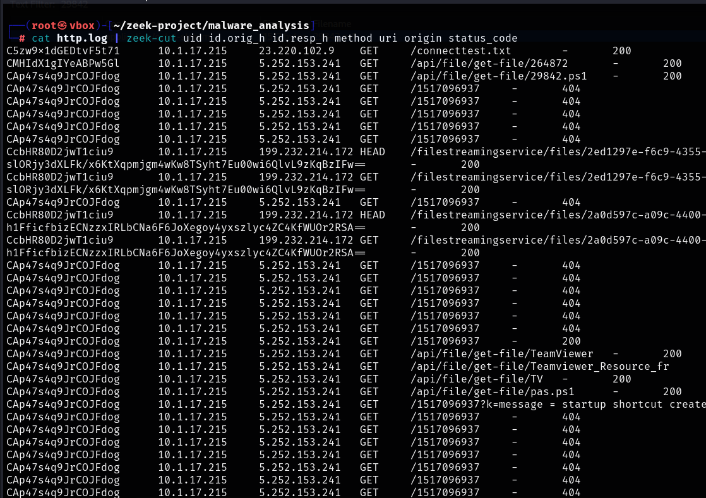  
*HTTP 404 anomalies possibly related to C2 polling.*

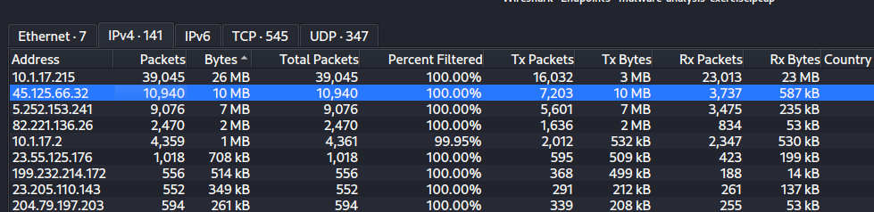  
*Large outbound transfer suggesting exfiltration.*

---

## File Analysis

### Extracted HTTP Artifacts
- `pas.ps1` — Loader PowerShell script  
- `29842.ps1` — Stage 2 payload  
- `1517096937(464)` — Numeric beacon file  

### Findings
- All `.ps1` files flagged as malicious on VirusTotal / Any.Run  
- Techniques observed:  
  - PowerShell execution (T1059.001)  
  - C2 communication over HTTP (T1071.001)  
  - Exfiltration (T1041)  
  - Persistence artifacts detected  

### Visuals

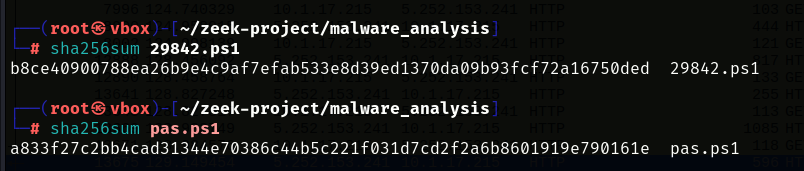  
*SHA256 hash verification of downloaded payloads.*

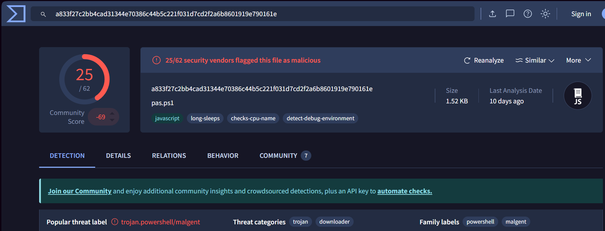  
*VirusTotal match for pas.ps1.*

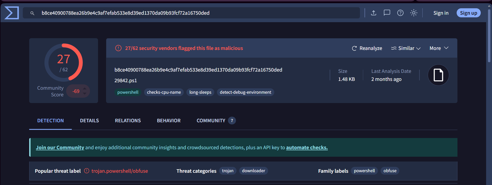  
*VirusTotal match for 29842.ps1.*

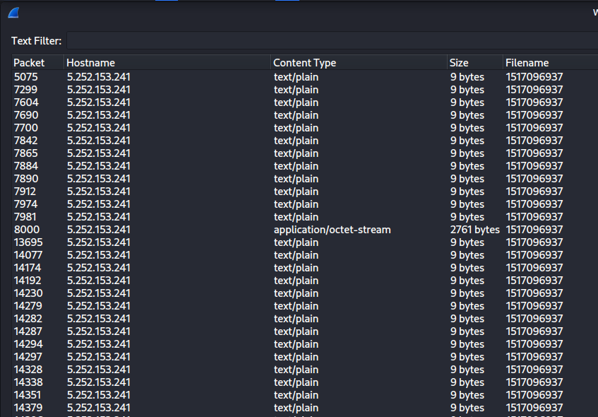  
*Multiple HTTP objects named 1517096937 detected.*

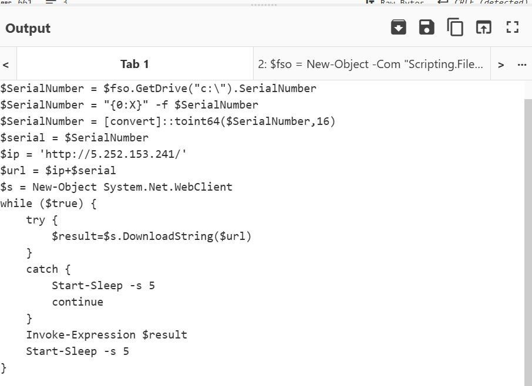  
*Decoded contents of pas.ps1 in CyberChef.*

---

## Behavioral Analysis

Because only a PCAP was available, the behavioral analysis is limited to on-wire activity. The following behaviors were observed from the traffic:
- **Staged download:** Multiple HTTP GETs returned PowerShell scripts (`pas.ps1`, `29842.ps1`) — consistent with downloader stages.  
- **Beaconing:** Repeated numeric resource requests (e.g., `/1517096937`) consistent with periodic C2 polling.  
- **Data exfiltration:** A ~10 MB outbound transfer to `45[.]125[.]66[.]32`. The content type and HTTP methods should be inspected to classify the exfiltration channel
- **Possible obfuscation:** PowerShell scripts observed on the wire were encoded/obfuscated; recommend saving and running through CyberChef or a sandbox for decoding when safe.

---

## MITRE ATT&CK Mapping

| Technique ID | Technique | Tactic | Description |
|---------------|------------|---------|------------|
| T1059.001 | PowerShell (Command Interpreter) | Execution | Adversaries may abuse PowerShell commands and scripts for execution.PowerShell may also be used to download and run executables from the Internet, which can be executed from disk or in memory without touching disk. |
| T1071.001 | Web Protocols (C2 over HTTP) | Command & Control | Adversaries may communicate using application layer protocols associated with web traffic to avoid detection/network filtering by blending in with existing traffic. Commands to the remote system, and often the results of those commands, will be embedded within the protocol traffic between the client and server. |
| T1041 | Exfiltration Over C2 Channel | Exfiltration | Adversaries may steal data by exfiltrating it over an existing command and control channel. Stolen data is encoded into the normal communications channel using the same protocol as command and control communications. |
| T1189 | Drive-by Compromise | Initial Access | Adversaries may gain access to a system through a user visiting a website over the normal course of browsing. |
| T1204 | User Execution | Execution | An adversary may rely upon specific actions by a user in order to gain execution. Users may be subjected to social engineering to get them to execute malicious code by, for example, opening a malicious document file or link.  |


---

## Immediate Response

1. **Containment:** Block `authenticatoor[.]org`, `5[.]252[.]153[.]241`, `45[.]125[.]66[.]0/24` at perimeter firewalls and proxy.  
2. **Eradication:** If host access is available, isolate `10[.]1[.]17[.]215`, collect memory and disk images and remove malicious artifacts present on the device.  
3. **Recovery:** Re-image affected hosts if persistence is confirmed or if remediation steps cannot reliably remove the foothold.  
4. **Detection:** Deploy the Zeek notice script; tune for false positives. Add SHA256s to endpoint detection lists.  
5. **Post-incident:** Perform a full user awareness and password reset for impacted accounts/devices that may have been exfiltrated.

---

## ELK Dashboards

A custom ELK pipeline was created to ingest JSON logs for IOC visualization.  
You can find the Kibana NDJSON dashboard file here: [Malware_Analysis_IOC.ndjson](https://github.com/sk-athar/Malware-Analysis-Project/blob/main/ELK/Malware_Analysis_IOC.ndjson)

### Dashboard Visuals
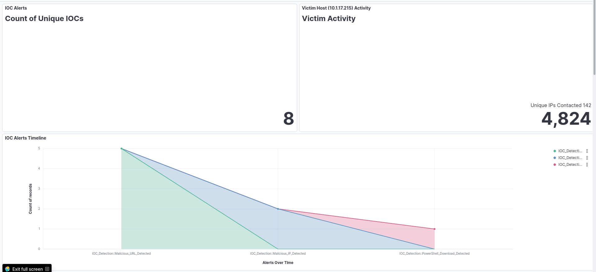
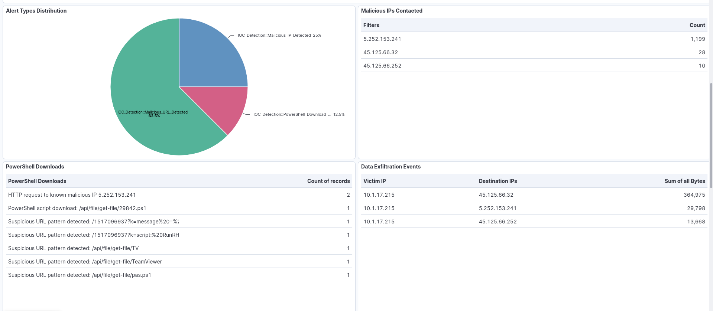
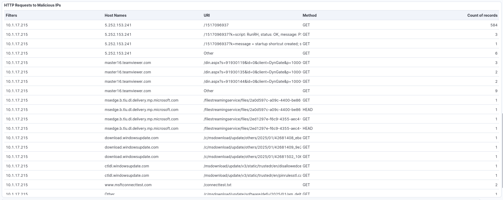
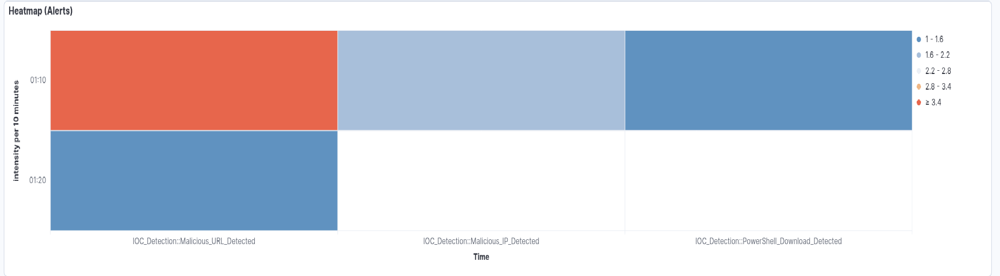

---

## Reproduction Steps

```bash
# 1. Run Zeek
zeek -r malware-analysis-exercise.pcap

# 2. Inspect connections
cat conn.log | zeek-cut id.orig_h id.resp_h proto service duration

# 3. Inspect HTTP logs
cat http.log | zeek-cut id.orig_h id.resp_h method uri status_code

# 4. Extract HTTP objects in Wireshark
File > Export Objects > HTTP > Save all (or select artifacts)

# 5. Verify hashes
sha256sum <filename>
md5sum <filename>

# note: most of the analysis was done on wireshark
```

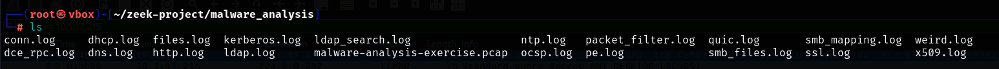  
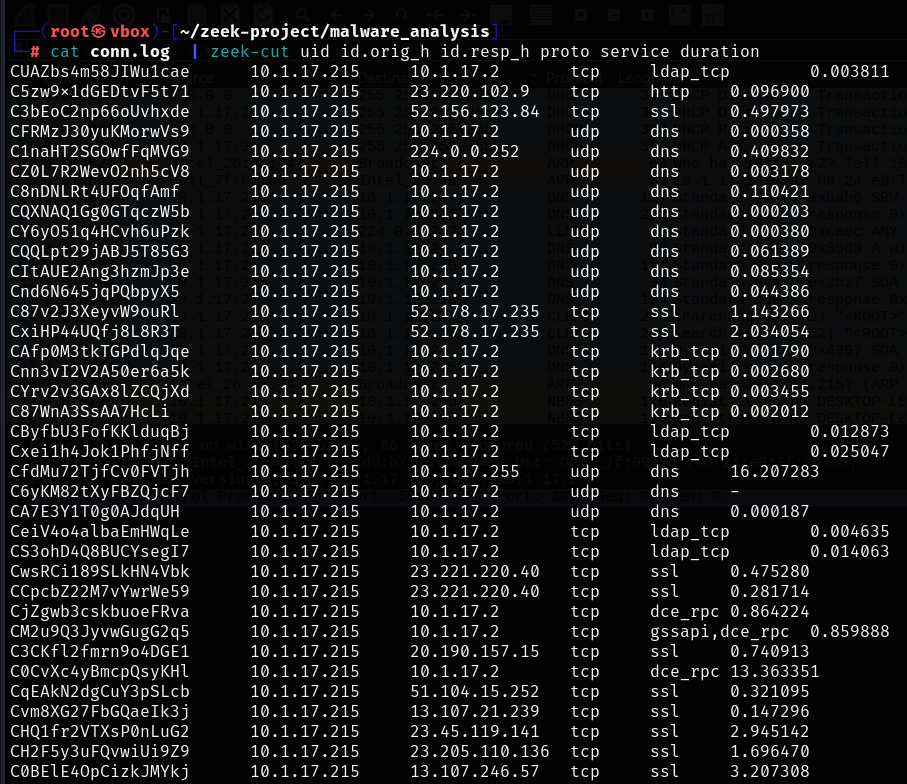  
  
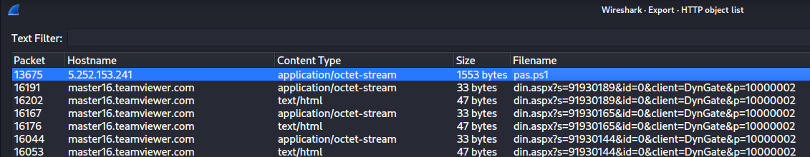

---

### Zeek IOC Detection

IOC detection rule: [ioc-detection.zeek](https://github.com/sk-athar/Malware-Analysis-Project/blob/main/zeek_rules/ioc-detection.zeek)

```bash
# Generate Zeek logs and alert file
zeek -C -r malware-analysis-exercise.pcap ioc-detection.zeek
# note ioc-detection.zeek creates logs in JSON format

# Review notice.log (JSON format)
cat notice.log | jq -r '. | "\n=== ALERT: \(.note) ===\nTime: \(.ts)\nMessage: \(.msg)\nDetails: \(.sub // "N/A")\nSource: \(.["id.orig_h"] // "N/A") -> Dest: \(.["id.resp_h"] // "N/A")\n"'
```

*JSON format is ingestion-ready for ELK or Splunk dashboards.*

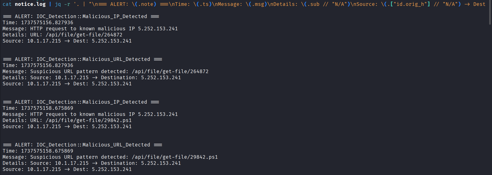  
*Zeek notice.log with IOC alerts. Full alerts can be found in zeek-rules*

---

## Answers to orignal questions posted by the author with pcap file
1. What is the IP address of the infected Windows client? :- 10[.]1[.]17[.]215
2. What is the mac address of the infected Windows client? :- 00[:]d0[:]b7[:]26[:]4a[:]74
3. What is the host name of the infected Windows client? :- DESKTOP-L8C5GSJ
4. What is the user account name from the infected Windows client? :- shutchenson
5. What is the likely domain name for the fake Google Authenticator page? :- authenticatoor[.]org
6. What are the IP addresses used for C2 servers for this infection? :- 5[.]252[.]153[.]241 , 45[.]125[.]66[.]32, 45[.]125[.]66[.]252

---

## License & Attribution

**License:** MIT  
**Author:** SOC Analyst (Student Project)  
**Dataset:** [malware-traffic-analysis.net (2025-01-22)](https://www.malware-traffic-analysis.net/2025/01/22/index.html)

---

**End of Report**
