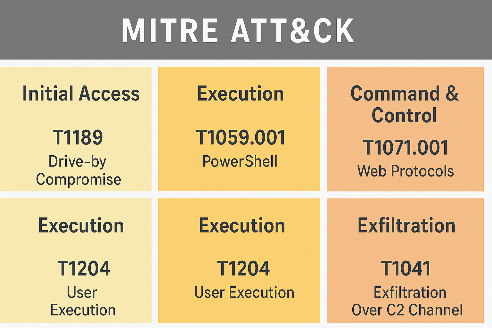

# Malware Analysis Report — Fake Software Download Site

**Analyst:** SOC Analyst (Student Project)  
**Category:** Network Forensics & Malware Traffic Analysis  
**Tools Used:** Zeek, Wireshark, CyberChef, VirusTotal, ELK Stack  

---

## Executive Summary

This report investigates malicious network activity originating from a fake software download website.  
Captured traffic revealed PowerShell payloads, command-and-control (C2) communications over HTTP, and data exfiltration (~10 MB) to an external IP.  
Artifacts confirm staged payload delivery and exfiltration via encoded HTTP sessions.

---

## Table of Contents
1. [Investigation Overview](#investigation-overview)  
2. [Key Artifacts & IOCs](#key-artifacts--iocs)  
3. [Event Timeline](#event-timeline)  
4. [Network Analysis](#network-analysis)  
5. [File Analysis](#file-analysis)  
6. [MITRE ATT&CK Mapping](#mitre-attck-mapping)  
7. [ELK Dashboards](#elk-dashboards)  
8. [Reproduction Steps](#reproduction-steps)  
9. [License & Attribution](#license--attribution)

---

## Investigation Overview

| Field | Details |
|-------|----------|
| Victim Host | 10.1.17.215 |
| Hostname | DESKTOP-L8C5GSJ |
| Domain | bluemoontuesday.com |
| Controller | WIN-GSH54QLW48D (10.1.17.2) |
| Malicious IPs | 5[.]252[.]153[.]241, 45[.]125[.]66[.]32 – 45[.]125[.]66[.]252 |
| Suspicious Domain | authenticatoor[.]org |

---

## Key Artifacts & IOCs

| Type | Value | Description |
|------|--------|-------------|
| Filename | pas.ps1 | PowerShell loader script |
| Filename | 29842.ps1 | Stage 2 PowerShell payload |
| Filename | 1517096937(464) | Numeric C2 beacon file |
| SHA256 | b8ce40900788ea26b9e4c9af7efab533e8d39ed1370da09b93fcf72a16750ded | 29842.ps1 |
| SHA256 | a833f27c2bb4cad31344e70386c44b5c221f031d7cd2f2a6b8601919e790161e | pas.ps1 |
| SHA256 | d63f0163a727b8bc2abe6d35b56468c5ac048b15c63c3faeba1dca054c3704bc | 1517096937(464) |

---

## Event Timeline

| Packet No. | Time (s) | Event Details |
|-------------|----------|----------------|
| 2330 | 38.269838 | User accessed google-authenticator[.]burleson-appliance[.]net |
| 2332 | 38.299460 | TCP payload (1006 bytes) |
| 2364 | 38.863141 | First contact with 5[.]252[.]153[.]241 / authenticatoor[.]org |
| 5028 | 60.135270 | File "264872" downloaded |
| 5063 | 62.145732 | File "29842.ps1" downloaded |
| 5073 | 62.366091 | File "1517096937" downloaded |
| 13671 | 128.984576 | File "pas.ps1" downloaded |
| 19302 | 889.561525 | First contact with 45[.]125[.]66[.]32 |
| 22750–22928 | 903–907 | Data exfiltration (~10 MB) to 45[.]125[.]66[.]32 |

---

## Network Analysis

**Observations:**
- Multiple HTTP GET requests retrieved obfuscated PowerShell payloads (`pas.ps1`, `29842.ps1`) from 5[.]252[.]153[.]241  
- Numeric file requests (`/1517096937`) indicate C2 beaconing behavior  
- Outbound data (~10 MB) to 45[.]125[.]66[.]32 confirms data exfiltration activity  

### Visuals

  
*HTTP 404 anomalies possibly related to C2 polling.*

  
*Large outbound transfer suggesting exfiltration.*

---

## File Analysis

### Extracted HTTP Artifacts
- `pas.ps1` — Loader PowerShell script  
- `29842.ps1` — Stage 2 payload  
- `1517096937(464)` — Numeric beacon file  

### Sandbox Findings
- All `.ps1` files flagged as malicious on VirusTotal / Any.Run  
- Techniques observed:  
  - PowerShell execution (T1059.001)  
  - C2 communication over HTTP (T1071.001)  
  - Exfiltration (T1041)  
  - Persistence artifacts detected  

### Visuals

  
*SHA256 hash verification of downloaded payloads.*

  
*VirusTotal match for pas.ps1.*

  
*VirusTotal match for 29842.ps1.*

  
*Multiple HTTP objects named 1517096937 detected.*

  
*Decoded contents of pas.ps1 in CyberChef.*

---

## MITRE ATT&CK Mapping

| Technique ID | Technique | Tactic |
|---------------|------------|---------|
| T1059.001 | PowerShell (Command Interpreter) | Execution |
| T1071.001 | Web Protocols (C2 over HTTP) | Command & Control |
| T1041 | Exfiltration Over C2 Channel | Exfiltration |
| T1189 | Drive-by Compromise | Initial Access |
| T1204 | User Execution | Execution |



---

## ELK Dashboards

A custom ELK pipeline was created to ingest JSON logs for IOC visualization.  
You can find the Kibana NDJSON dashboard file here: [Malware_Analysis_IOC.ndjson](https://github.com/sk-athar/Malware-Analysis-Project/blob/main/ELK/Malware_Analysis_IOC.ndjson)

Dashboard Visuals


---

## Reproduction Steps

```bash
# 1. Run Zeek
zeek -r malware-analysis-exercise.pcap

# 2. Inspect connections
cat conn.log | zeek-cut id.orig_h id.resp_h proto service duration

# 3. Inspect HTTP logs
cat http.log | zeek-cut id.orig_h id.resp_h method uri status_code

# 4. Extract HTTP objects in Wireshark
File > Export Objects > HTTP > Save all (or select artifacts)

# 5. Verify hashes
sha256sum <filename>
md5sum <filename>
```

  
  
  


---

### Zeek IOC Detection

IOC detection rule: [ioc-detection.zeek](https://github.com/sk-athar/Malware-Analysis-Project/blob/main/zeek_rules/ioc-detection.zeek)

```bash
# Generate Zeek logs and alert file
zeek -C -r malware-analysis-exercise.pcap ioc-detection.zeek

# Review notice.log (JSON format)
cat notice.log | jq -r '. | "\n=== ALERT: \(.note) ===\nTime: \(.ts)\nMessage: \(.msg)\nDetails: \(.sub // "N/A")\nSource: \(.["id.orig_h"] // "N/A") -> Dest: \(.["id.resp_h"] // "N/A")\n"'
```

*JSON format is ingestion-ready for ELK or Splunk dashboards.*

  
*Zeek notice.log with IOC alerts.*

---

## License & Attribution

**License:** MIT  
**Author:** SOC Analyst (Student Project)  
**Dataset:** [malware-traffic-analysis.net (2025-01-22)](https://www.malware-traffic-analysis.net/2025/01/22/index.html)

---

**End of Report**
